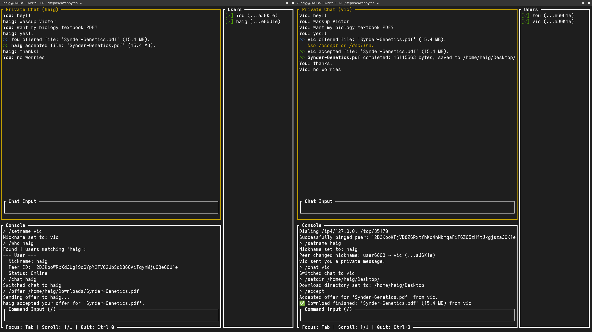

# Demo of SwapBytes

This is an example interaction between two SwapBytes users on the same local machine.

---

### 1. New sessions

Both users have detected each other, but lost connection (as seen by the `[✗]`).

### 2. Manual connection

One user runs `/me` to get their `multiaddr`. The other user runs `/ping <multiaddr>` to initiate a lasting connection.

### 3. Set nicknames

Both users set their nicknames using `setname <name>` and one user uses `/who <name>` on the other user.

### 4. Open private chat

Both users use `/chat <name>` to open private chats with each other and they talk.

### 5. File offer

One user offers the other a PDF file using `/offer <file>`. The other user makes sure they used `/setdir <dir>` before accepting the offer.

### 6. File transfer

By running `/accept`, the file transfer starts notifying both parties. The receiver can see the progress as it happens.

### 7. File transfer completion

The transfer completed effectively and the receiver says "thanks!".

 